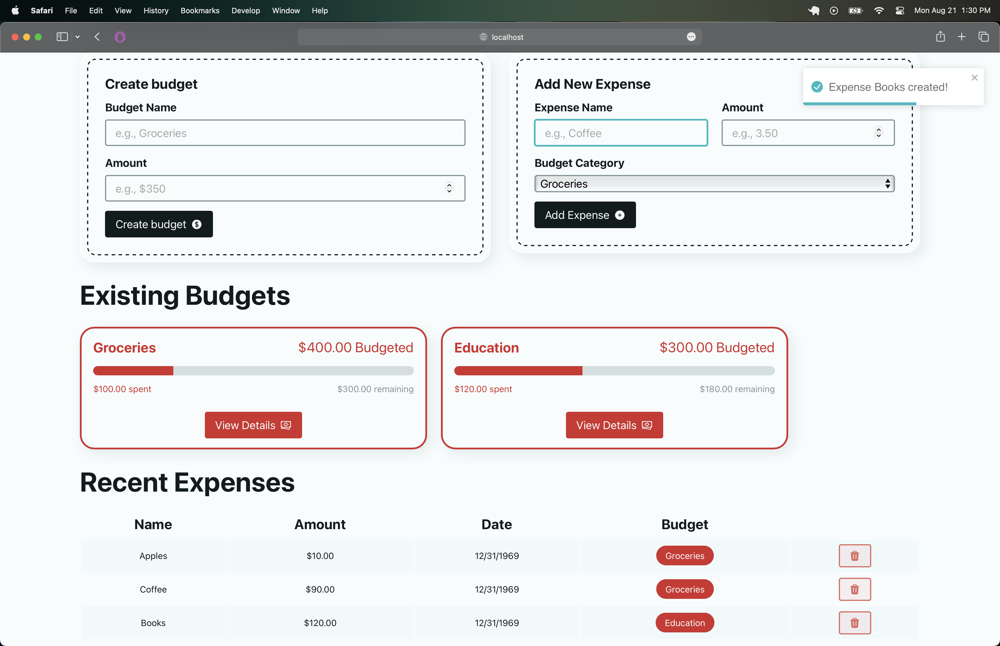

# budgeting-app
react + spring boot full-stack budgeting app

* React
* Spring Boot
* Maven
* Postgres

Using:
The app is not yet deployed but you can run it locally:
1. Run a postgres server with a 'budget' database already created
   - check the application.properties file if you have set a username and password
3. Start the spring boot application in the root of the repository
4. Start the react client 

